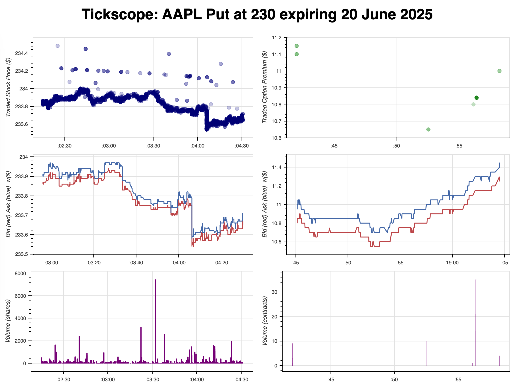

</p>

## Tickscope

Tickscope is a simple Python-based web application for monitoring live trading data in real-time. Inspired by an oscilloscope used in electronics, Tickscope streams detailed real-time data for a single option contract along with its underlying stock, as illustrated in the screenshot below



and [this real-time clip of it in action](https://www.youtube.com/watch?v=jjH9sx_A8j4&hd=1).

Keep in mind you'll need a Polygon.io "Stocks Advanced" and "Options Advanced" subscription. Without those, Tickscope is enthusiastic but not particularly useful.

## Project Progress Highlights

- **2025-03-06**: Added Bid-Ask Spread and Volume Heartbeat charts (so three charts for underlying, and three for option contract).
- **2025-03-04**: You can now see option contract trades as well.
- **2025-02-19**: The thing works. You can now watch stock trades roll in one by one. Try not to get hypnotized.

## Running Tickscope

### Requirements
- Python 3.8+
- Polygon.io API key with a **"Stocks Advanced" and "Options Advanced" subscription**

## Quickstart

1. **Clone and enter the repo:**
   ```sh
   git clone <repo-url>
   cd tickscope
   ```

2. **Setup Python environment:**
   ```sh
   python -m venv venv
   source venv/bin/activate    # On macOS/Linux
   venv\Scripts\activate       # On Windows
   ```

3. **Install dependencies:**
   ```sh
   pip install -r requirements.txt
   ```

4. **Configure Polygon.io API:**
   Make sure your Polygon.io API key is set as an environment variable (`POLYGONIO_API_KEY`).

   **Subscriptions Required:**
   - Stocks Advanced
   - Options Advanced

5. **Run the app (example):**
   ```sh
   python app.py TSLA250404P00200000
   ```

Then open your browser and navigate to [http://localhost:8050](http://localhost:8050).

### Generating the Option Ticker
Option tickers follow this format:
```
<Underlying><Expiration><Type><Strike>
```
Example breakdown:
- **Underlying**: TSLA (Tesla)
- **Expiration**: YYMMDD (e.g., 250404 for April 4, 2025)
- **Type**: C for Call, P for Put
- **Strike**: 8 digits, strike price × 1000 (e.g., $200 → 00200000)

A small widget to easily generate these tickers will be added soon.

