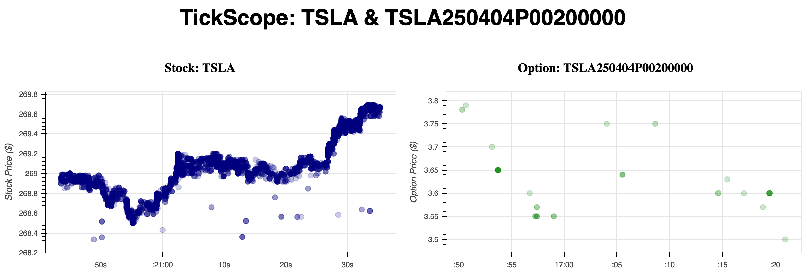

</p>

## Tickscope

Tickscope is a simple Python-based web application for monitoring live trading data in real-time.  The aim is that this tool should be used to monitor real-time happenings for a stock and option contact in a way similar to the way that an scope is used in electronics: the tool just streams the data.  You do with it what you want. The tool is new.  Currently it supports simultaneous monitoring real-time data from two web sockets for trades of a single stock and a single option contract, like in the screenshot below.



If you're someone who loves detailed market data (perhaps more than most), Tickscope is being built for you. Keep in mind you'll need a **Polygon.io "Stocks Advanced" and "Options Advanced" subscription** for full functionality. Without this, Tickscope is enthusiastic but not particularly useful.

## Project Progress Highlights

- 2025-03-04: You can now see option contract trades as well.
- 2025-02-19: The thing works. You can now watch stock trades roll in one by one. Try not to get hypnotized.


## Running Tickscope

### Requirements
- Python 3.8+
- Polygon.io API key with a **"Stocks Advanced" and "Options Advanced" subscription**

## Quickstart

1. **Clone and enter the repo:**
   ```sh
   git clone <repo-url>
   cd tickscope
   ```

2. **Setup Python environment:**
   ```sh
   python -m venv venv
   source venv/bin/activate    # On macOS/Linux
   venv\Scripts\activate       # On Windows
   ```

3. **Install dependencies:**
   ```sh
   pip install -r requirements.txt
   ```

4. **Configure Polygon.io API:**
   Make sure your Polygon.io API key is set as an environment variable (`POLYGONIO_API_KEY`).

   **Subscriptions Required:**
   - Stocks Advanced
   - Options Advanced

5. **Run the app:**
   ```sh
   python app.py TSLA TSLA250404P00200000
   ```

Then open your browser and navigate to [http://localhost:8050](http://localhost:8050).

Enjoy your detailed trading insights!