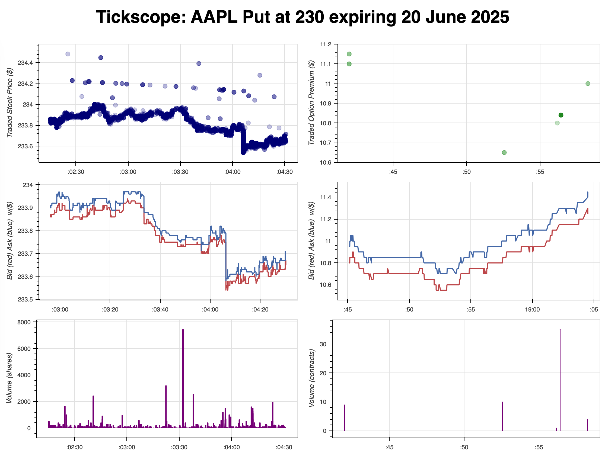
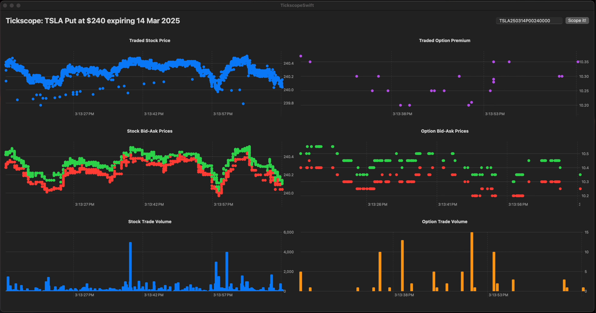

# Tickscope

Tickscope is a real-time market data visualization tool. This repository contains two separate implementations of Tickscope:

- **Python Version** (`python-version` branch): A web application using Python and Dash.
  
  


- **Swift Version** (`swift-version` branch): A macOS-native application built with Swift and SwiftUI.

  


## Switching Between Versions

Each version has its own branch. Switch between versions using:

```bash
git checkout python-version  # Switch to the Python version
git checkout swift-version   # Switch to the Swift version
```

## Choosing the Right Version

- If you want a Python-based web application, use the `python-version` branch.
- If you prefer a native macOS application, use the `swift-version` branch.

Each branch contains its own `README.md` file with setup instructions specific to that version.

## Project Overview

Tickscope provides live streaming of stock and option contract data, visualizing trades, bid-ask spreads, and volume in real-time.

For more details, check the respective branch's README.

> **Note:** This `main` branch serves as an entry point and does not contain the actual implementation. To get started, switch to the appropriate branch.
